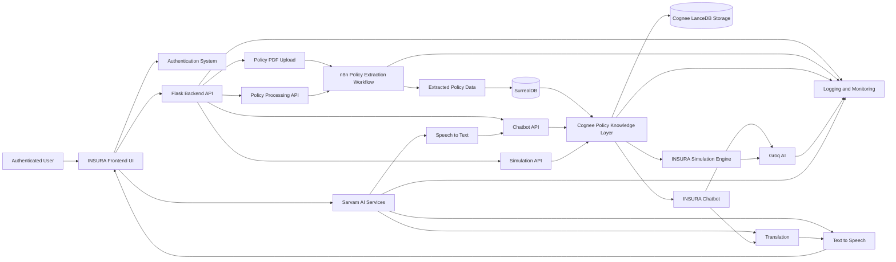
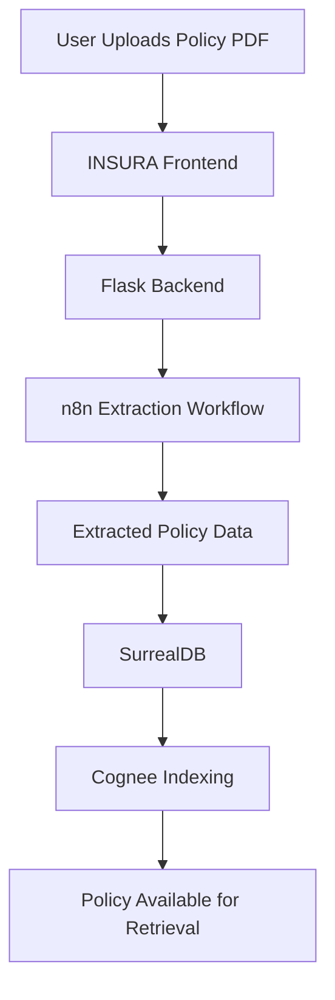
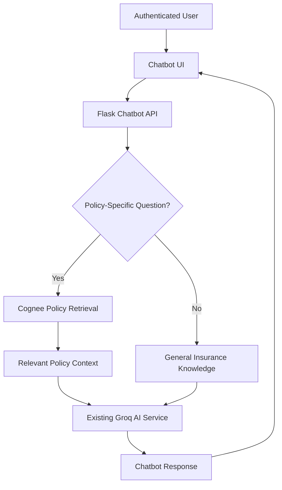
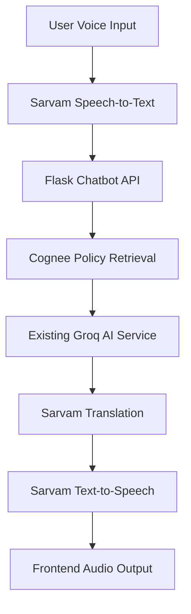

# 🛡️ INSURA — Intelligent Insurance Assistant

<p align="center">
  <strong>Understand your insurance. Make informed decisions.</strong>
</p>

<p align="center">
  An AI-powered insurance assistant that transforms complex insurance policies into an accessible, conversational experience.
</p>

<p align="center">


</p>

---

## 📌 Overview

**INSURA** is an intelligent insurance assistant designed to simplify complex insurance documents and improve the way users interact with their insurance policies.

Users can upload their insurance policy PDFs, which are processed through an automated **n8n extraction workflow**. The extracted information is stored in **SurrealDB** and indexed into **Cognee**, enabling contextual and policy-specific retrieval for the chatbot.

INSURA combines:

- 📄 Automated insurance policy document extraction
- 🤖 AI-powered policy chatbot
- 🧠 Policy-aware knowledge retrieval with Cognee
- 💬 General insurance question answering
- 🎯 Insurance simulation capabilities
- 🌐 Multilingual interaction using Sarvam AI
- 🎙️ Speech-to-text and text-to-speech support
- 🔐 User-specific policy data isolation
- 📊 Centralized logging and monitoring

The goal is to provide users with an accessible, conversational, and intelligent way to understand their insurance coverage.

---
## 🏗️ System Architecture

The following diagram illustrates the major components of the INSURA platform.



---

## ✨ Key Features

### 📄 1. Insurance Policy Upload and Extraction

Users can upload insurance policy PDF documents through the INSURA frontend.

The policy processing pipeline:

1. The user uploads a policy PDF.
2. The Flask backend sends the document to the n8n workflow.
3. n8n extracts structured policy information.
4. Extracted policy data is stored in SurrealDB.
5. Relevant policy information is indexed into Cognee.
6. The policy becomes available for contextual chatbot retrieval.

🔗 **[View the n8n Policy Extraction Workflow](./n8n/insura-policy-extraction-workflow.json)**

> The workflow file should be stored in the repository at:
>
> `n8n/insura-policy-extraction-workflow.json`

---

### 🤖 2. AI Insurance Chatbot

The INSURA chatbot allows authenticated users to ask questions about their insurance policies.

Example questions:

- What is my policy coverage?
- What is my deductible?
- Does my policy cover hospitalization?
- What exclusions are mentioned in my policy?
- What is the claim process?
- What benefits are included in my insurance plan?

The chatbot uses:

```text
User Question
      ↓
Flask Chatbot API
      ↓
Cognee Policy Retrieval
      ↓
Relevant Policy Information
      ↓
Existing Groq AI Service
      ↓
INSURA Chatbot Response
```

The chatbot is designed to use policy-specific context when available.

If a requested fact is not present in the user's policy, the chatbot should respond:

> "This is not specified in your policy"

The system should not invent or assume missing policy information.

General insurance questions can continue to work without requiring policy-specific retrieval.

---

### 🧠 3. Cognee Knowledge Layer

INSURA uses **Cognee** as a policy knowledge and retrieval layer.

Cognee is responsible for organizing and retrieving relevant policy information. SurrealDB remains the primary application database and source of truth.

Cognee is not intended to replace:

- SurrealDB
- The existing chatbot service
- The existing simulation service
- The n8n extraction workflow
- The Groq AI integration

#### Cognee Responsibilities

- Index extracted policy information
- Support semantic policy retrieval
- Provide relevant policy context to the chatbot
- Maintain policy-scoped knowledge
- Support reindexing when a policy is updated or replaced
- Prevent cross-user policy data leakage
- Gracefully handle retrieval or indexing failures

#### Policy Retrieval Flow

```text
SurrealDB
    ↓
Cognee Indexing
    ↓
Cognee Knowledge Storage
    ↓
Policy-Specific Retrieval
    ↓
Existing Groq AI Service
```

Cognee retrieval must be scoped by:

- Authenticated user ID
- Policy ID
- Relevant policy context

Users must never retrieve information belonging to another user.

---

### 🎯 4. Insurance Simulation

INSURA includes an insurance simulation feature that can help users explore insurance-related scenarios.

The simulation service remains part of the existing backend architecture.

Cognee may optionally provide relevant policy information to the simulation service, but the simulation logic remains outside Cognee.

```text
User
  ↓
Simulation API
  ↓
Optional Policy Retrieval
  ↓
Existing Simulation Engine
  ↓
Groq AI
  ↓
Simulation Response
```

The simulation system must continue to use the existing simulation route and service rather than introducing a separate simulation architecture.

---

### 🌐 5. Sarvam AI Integration

INSURA can integrate Sarvam AI services to support multilingual and voice-based interactions.

Potential capabilities include:

- 🎙️ Speech-to-text
- 🌍 Language translation
- 🔊 Text-to-speech

#### Voice Interaction Flow

```text
User Voice Input
      ↓
Sarvam Speech-to-Text
      ↓
Flask Chatbot API
      ↓
Policy Retrieval with Cognee
      ↓
Groq AI Response
      ↓
Sarvam Translation
      ↓
Sarvam Text-to-Speech
      ↓
Frontend Audio Output
```

Sarvam AI configuration should be managed through environment variables.

API keys must never be hardcoded or committed to the repository.

---

## 🔄 Core Application Workflows

### Policy Processing Workflow



### Policy Chatbot Workflow



### Voice and Translation Workflow



---

## 🧰 Technology Stack

| Layer | Technology | Responsibility |
|---|---|---|
| Frontend | Existing INSURA UI | User interface and interaction |
| Backend | Flask | API routes and application logic |
| Authentication | Existing authentication system | User authentication and identity |
| Workflow Automation | n8n | Policy document extraction |
| Primary Database | SurrealDB | Application data and extracted policies |
| Knowledge Layer | Cognee 1.6.0 | Policy indexing and retrieval |
| Vector Storage | LanceDB | Cognee vector persistence |
| Language Model | Groq AI | Chatbot and simulation responses |
| Voice and Language | Sarvam AI | Speech, translation, and voice services |
| Monitoring | Application logging and monitoring | Operational visibility |

---

## 📁 Suggested Repository Structure

```text
INSURA/
│
├── frontend/
│   └── ...
│
├── backend/
│   ├── app/
│   │   ├── routes/
│   │   ├── services/
│   │   ├── models/
│   │   └── ...
│   │
│   ├── cognee/
│   │   ├── initialization.py
│   │   ├── indexing.py
│   │   └── retrieval.py
│   │
│   ├── tests/
│   ├── .env.example
│   └── requirements.txt
│
├── n8n/
│   ├── insura-policy-extraction-workflow.json
│   └── README.md
│
├── docs/
│   └── architecture.md
│
├── .gitignore
└── README.md
```

---

## ⚙️ Installation and Setup

### 1. Clone the Repository

```bash
git clone https://github.com/YOUR_USERNAME/INSURA.git
cd INSURA
```

Replace `YOUR_USERNAME` with your GitHub username or organization.

---

### 2. Configure the Backend Environment

Create a `.env` file inside the backend directory.

```bash
cp backend/.env.example backend/.env
```

Configure the required environment variables:

```env
# Flask
FLASK_ENV=development
FLASK_DEBUG=true

# Authentication
AUTH_SECRET_KEY=your_secret_key

# SurrealDB
SURREALDB_URL=your_surrealdb_url
SURREALDB_NAMESPACE=your_namespace
SURREALDB_DATABASE=your_database
SURREALDB_USER=your_username
SURREALDB_PASSWORD=your_password

# Groq
GROQ_API_KEY=your_groq_api_key
GROQ_MODEL=your_groq_model

# Cognee
COGNEE_SYSTEM_ROOT_DIRECTORY=./.cognee_data/system
COGNEE_DATA_ROOT_DIRECTORY=./.cognee_data/data

# Sarvam AI
SARVAM_API_KEY=your_sarvam_api_key

# n8n
N8N_WEBHOOK_URL=your_n8n_webhook_url
```

> Do not commit `.env` files, API keys, database credentials, or private configuration to GitHub.

---

### 3. Install Backend Dependencies

Create and activate a virtual environment:

```bash
python -m venv venv
```

#### Windows

```bash
venv\Scripts\activate
```

#### macOS/Linux

```bash
source venv/bin/activate
```

Install dependencies:

```bash
pip install -r backend/requirements.txt
```

---

### 4. Configure n8n

Import the INSURA policy extraction workflow into your n8n instance.

📌 **Workflow file:**

[Open INSURA n8n Policy Extraction Workflow](./n8n/insura-policy-extraction-workflow.json)

Configure the required credentials and environment-specific settings inside n8n.

The workflow should:

1. Receive the uploaded policy document.
2. Extract relevant policy information.
3. Return or store the extracted structured data.
4. Allow the Flask backend to persist the extracted policy information in SurrealDB.
5. Trigger or support the Cognee indexing process after successful storage.

Avoid storing credentials directly in the exported workflow file.

---

### 5. Start the Backend

Run the Flask application using the project's configured entry point.

Example:

```bash
python backend/app.py
```

> The exact command may vary depending on the existing INSURA backend structure.

---

### 6. Start the Frontend

Navigate to the frontend directory:

```bash
cd frontend
```

Install frontend dependencies:

```bash
npm install
```

Start the development server:

```bash
npm run dev
```

---

## 🔌 Application API Responsibilities

The existing backend API is responsible for coordinating the INSURA services.

| API Component | Responsibility |
|---|---|
| Policy Upload API | Receives policy documents |
| Policy Processing API | Sends documents to n8n |
| Chatbot API | Handles user questions and responses |
| Simulation API | Handles insurance simulation requests |
| Authentication | Identifies the current authenticated user |
| Cognee Service | Indexes and retrieves policy information |
| Sarvam Integration | Handles voice and translation functionality |

The existing chatbot and simulation routes should be reused. INSURA should not create duplicate chatbot or simulation systems.

---

## 🔐 Security and Data Isolation

INSURA is designed to process sensitive insurance information. Security and data isolation are essential.

### Security Requirements

- Authenticate users before accessing private policies.
- Scope policy retrieval by authenticated user ID.
- Scope policy retrieval by policy ID.
- Prevent cross-user policy information leakage.
- Never expose API keys in frontend code.
- Store secrets in environment variables.
- Do not commit `.env` files.
- Validate uploaded documents.
- Apply appropriate file size and type restrictions.
- Avoid logging sensitive policy information.
- Handle third-party API failures safely.
- Do not generate unsupported policy facts.

### Policy Accuracy Rule

If the requested information is not available in the user's policy, the chatbot must return:

```text
This is not specified in your policy
```

The chatbot must not fabricate coverage limits, exclusions, deductibles, claim requirements, or other policy details.

---

## 🧠 AI Response Strategy

INSURA uses a combination of retrieval and generative AI.

```text
Authenticated User Question
          ↓
Question Classification
          ↓
Policy Retrieval When Applicable
          ↓
Relevant Context Collection
          ↓
Existing Groq AI Service
          ↓
Grounded Response
```

The response strategy should distinguish between:

### Policy-Specific Questions

Use Cognee to retrieve relevant information from the authenticated user's policy.

Examples:

- What is my deductible?
- Does my policy cover dental treatment?
- What is my hospitalization limit?

### General Insurance Questions

Answer general insurance questions using the existing AI service without requiring policy-specific retrieval.

Examples:

- What is a deductible?
- What is coinsurance?
- What is the difference between term and whole life insurance?

### Missing Policy Information

If the policy does not contain the requested information:

```text
This is not specified in your policy
```

---

## 🔁 Policy Updates and Reindexing

When a policy is uploaded, replaced, or updated:

1. Store the latest structured policy data in SurrealDB.
2. Identify the associated user and policy.
3. Remove or invalidate outdated indexed content when necessary.
4. Reindex the latest policy information in Cognee.
5. Ensure retrieval returns the current policy version.
6. Prevent duplicate indexing where possible.

SurrealDB remains the source of truth for policy records.

---

## 🧪 Testing

Recommended testing areas include:

- Authentication and authorization
- Policy upload validation
- n8n workflow integration
- SurrealDB policy persistence
- Cognee initialization
- Policy indexing
- Policy retrieval
- User and policy data isolation
- Chatbot response grounding
- Missing policy information handling
- Simulation behavior
- Sarvam integration
- Graceful third-party service failures

Example Python syntax validation:

```bash
python -m py_compile backend/**/*.py
```

Use the project's configured testing framework and test commands for complete validation.

---

## 🛠️ Troubleshooting

### Cognee Is Unavailable

The application should handle Cognee failures gracefully.

Recommended behavior:

- Log the error without exposing secrets.
- Avoid crashing the complete chatbot service.
- Clearly distinguish unavailable retrieval from missing policy information.
- Continue general insurance functionality when possible.

### Groq Model Configuration

Ensure that the configured Groq model is supported by the selected Groq API configuration.

Keep model configuration in environment variables rather than hardcoding it throughout the application.

### n8n Workflow Failure

Check:

- n8n workflow execution logs
- Webhook URL configuration
- Authentication credentials
- Input document format
- Extracted output structure
- SurrealDB connection
- Backend error logs

### Missing Policy Information

If the requested fact is not present in the retrieved policy context, do not infer the answer.

Return:

```text
This is not specified in your policy
```

---

## 📚 Documentation

| Resource | Link |
|---|---|
| n8n Policy Extraction Workflow | [Open Workflow](./n8n/insura-policy-extraction-workflow.json) |
| System Architecture | [Architecture Documentation](./docs/architecture.md) |
| Backend | [Backend Directory](./backend/) |
| Frontend | [Frontend Directory](./frontend/) |

---

## 🚀 Future Improvements

Potential future enhancements include:

- Improved policy comparison
- Claim document assistance
- Policy renewal reminders
- Advanced multilingual support
- Voice-based policy conversations
- Policy coverage summaries
- Improved document validation
- Enhanced audit logging
- More detailed policy analytics
- Automated policy change detection
- Additional insurance product support

---

## ⚠️ Disclaimer

INSURA is an AI-powered insurance assistance platform.

AI-generated responses are intended to help users understand insurance-related information and should not be treated as a substitute for official policy documents, professional insurance advice, or confirmation from the relevant insurance provider.

Users should verify important coverage, exclusions, claim requirements, and financial decisions against their official policy documentation and insurer.

---

## 🤝 Contributing

Contributions are welcome.

To contribute:

1. Fork the repository.
2. Create a feature branch.

```bash
git checkout -b feature/your-feature
```

3. Make your changes.
4. Test your changes.
5. Commit your changes.

```bash
git commit -m "Add your feature"
```

6. Push your branch.

```bash
git push origin feature/your-feature
```

7. Open a pull request.

Please ensure that contributions maintain existing authentication, data isolation, chatbot, simulation, and policy-processing behavior.

---

## 📄 License

Add your project's license information here.

---

<p align="center">
  Built with ❤️ for a simpler and more accessible insurance experience.
</p>
